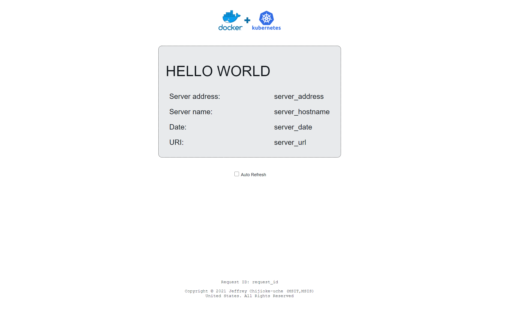

# Test the Docker Image

- On your cmd or terminal: Run this command
- docker run -it --rm -p 8080:80 jchijiok/helloworld:v1.0.0

## Result

- Browse to <http://localhost:8080> to view the default web page served by the application docker image in the running container.
- You should see a page similar to this below:

